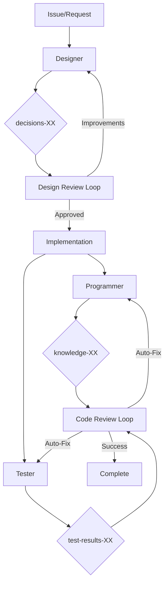

# ai-go - Autonomous Development Orchestrator

## Usage
```
/ai-go [issue-id or instruction]
```

Examples:
- `/ai-go issues-123` - Autonomously work on issue until completion
- `/ai-go "implement authentication"` - Design and implement the feature
- `/ai-go "React state management"` - Research and document the topic

## Task

@.claude/agents/LANG.markdown

Execute development workflow autonomously, solving problems independently until completion. Only escalate to user when truly stuck.

### Core Philosophy: Autonomous Problem Solving

**Key Principles**:
1. **AI solves problems independently** - No user interaction unless absolutely necessary
2. **Continuous improvement loop** - Design → Review → Improve until optimal
3. **Self-healing workflow** - Automatically retry and fix issues
4. **Zero user burden** - All decisions made autonomously

### Automatic Workflow Detection

The system automatically analyzes input and executes the complete workflow:

#### For Issues (e.g., `issues-123`):
1. **Fetch issue details** from MCP
2. **Analyze and plan** optimal approach
3. **Execute autonomous workflow**:
   - Research (if needed)
   - Design with built-in review cycles
   - Implementation
   - Code review
   - Testing
   - Automatic fixes for any issues found
4. **Continue until success** or truly unsolvable problem

#### For Instructions (e.g., `"implement authentication"`):
1. **Parse and understand** the request
2. **Create tracking issue** automatically
3. **Execute full workflow** with autonomous decision-making

### Autonomous Execution Flow

The system executes all tasks autonomously with built-in quality assurance:

#### 1. Design Phase with Auto-Review
```yaml
Design Loop:
1. Designer creates initial design
2. Automatic design review by Reviewer
3. If review finds issues:
   - Generate specific improvement suggestions
   - Designer automatically applies improvements
   - Return to step 2
4. Continue until design is optimal
5. No user intervention needed
```

#### 2. Implementation Phase
```yaml
Implementation:
1. Programmer implements based on approved design
2. Tester creates comprehensive test suite (parallel)
3. Both work from the same design document
4. Automatic coordination without user input
```

#### 3. Code Review with Auto-Fix
```yaml
Review Loop:
1. Reviewer examines implementation and tests
2. If issues found:
   - Generate specific fix instructions
   - Programmer/Tester automatically apply fixes
   - Return to step 1
3. Continue until code meets quality standards
4. No manual approval needed
```

### Specialist Agents

The system coordinates these specialists autonomously:

1. **shirokuma-researcher** - Investigates technologies and best practices
2. **shirokuma-designer** - Creates and iterates on technical designs
3. **shirokuma-reviewer** - Reviews designs and code, suggests improvements
4. **shirokuma-programmer** - Implements solutions based on designs
5. **shirokuma-tester** - Creates comprehensive test suites

All agents work together seamlessly without user coordination.

### Autonomous Workflow Orchestration

The system orchestrates everything automatically:

```yaml
Autonomous Flow:
1. Analyze input and understand requirements
2. Check existing work to avoid duplication
3. Execute iterative development:
   
   Design Phase:
   - Create design → Review → Improve → Repeat until optimal
   
   Implementation Phase:
   - Implement + Test (parallel) → Review → Fix → Repeat until perfect
   
4. Update all tracking automatically
5. Only escalate if truly stuck after multiple attempts
```

**Key Features**:
- No user interaction during execution
- Automatic retry with improvements
- Self-correcting based on review feedback
- Unlimited iteration until quality standards met

### MCP Data Flow



All loops execute automatically without user intervention.

### Error Handling

The system handles all errors autonomously:

```yaml
Autonomous Error Recovery:
1. Agent failure → Automatically retry with different approach
2. Review rejection → Apply feedback and retry
3. Test failure → Fix implementation and retry
4. Design issues → Iterate with improvements
5. Only after exhausting all options → Escalate to user

Error Resolution Strategy:
- Analyze error root cause
- Generate solution hypothesis
- Apply fix automatically
- Verify fix worked
- Continue workflow

User Escalation (Last Resort):
- Clear problem description
- What was tried
- Specific help needed
- Suggested solutions for user to choose
```

### Examples

```bash
# Simple usage - AI handles everything
/ai-go issues-123
# → AI analyzes, designs, reviews, improves, implements, tests, and completes autonomously

/ai-go "implement user authentication"
# → AI creates issue, researches best practices, iterates on design, implements with tests

/ai-go "fix the login button alignment"
# → AI identifies the issue, implements fix, verifies it works
```

**Remember**: The AI will work autonomously, iterating as many times as needed to achieve quality results. User intervention is only requested when absolutely necessary.


### Integration Points

- **issue-manager**: Tracks progress automatically
- **mcp-specialist**: Stores all artifacts and decisions
- **methodology-keeper**: Ensures quality standards
- **All agents**: Coordinate autonomously without user input

### Success Criteria

1. **Zero user interaction** during normal execution
2. **Automatic quality improvement** through iteration
3. **Self-healing workflows** that fix their own issues
4. **Complete documentation** of all decisions and changes
5. **Only escalate** when truly stuck

This command transforms AI from an assistant into an autonomous developer that takes ownership of tasks and delivers complete solutions.

## Implementation Guidelines

### Core Implementation Principles

1. **Autonomous by Default**
   - All decisions made by AI
   - No options or flags needed
   - Iterate until success

2. **Design Review Loop**
   ```
   while not optimal:
     design = create_design()
     feedback = review_design(design)
     if feedback.has_improvements:
       apply_improvements(feedback)
     else:
       break
   ```

3. **Code Review Loop**
   ```
   while not perfect:
     code = implement_solution()
     tests = create_tests()
     feedback = review_all(code, tests)
     if feedback.has_issues:
       apply_fixes(feedback)
     else:
       break
   ```

4. **Error Recovery**
   - Never give up on first failure
   - Try different approaches
   - Learn from each attempt
   - Only escalate after exhausting options

