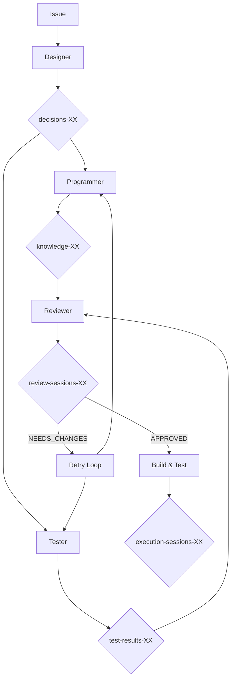
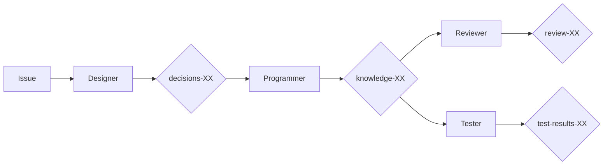

# ai-go - Orchestrate Development Workflow

## Usage
```
/ai-go [issue-id or instruction]
/ai-go [issue-id] [additional instruction]
```

Examples:
- `/ai-go issues-123` - Analyze issue and execute appropriate workflow
- `/ai-go issues-123 "focus on error handling"` - Work on issue with specific focus
- `/ai-go "React state management"` - Research and document the topic
- `/ai-go "implement authentication"` - Design and implement the feature
- `/ai-go issues-89` - Handle issue with parallel execution (default)
- `/ai-go issues-89 "keep it sequential"` - Handle issue with sequential execution

## Task

@.claude/agents/LANG.markdown

Parse the command arguments and automatically determine the appropriate workflow based on the input type and content.

### Automatic Workflow Detection

The command analyzes the input and selects the appropriate workflow:

#### For Issues (e.g., `issues-123` or `issues-123 "additional instruction"`):
1. **Fetch issue details** from MCP
2. **Analyze issue type** and content:
   - Bug → Design fix → Implement → Review → Test
   - Feature → Research (if needed) → Design → Implement → Review → Test
   - Research → Research → Document findings
   - Documentation → Research → Write documentation
3. **Check issue tags** for workflow hints:
   - `performance` → Include performance testing
   - `security` → Include security review
   - `urgent` → Ensure parallel execution (already default)
   - `complex` → Extra design phase focus
   - `sequential` → Force sequential execution
4. **Detect existing work**:
   - If design exists → Start from implementation
   - If implementation exists → Start from review
   - If all complete → Report status
5. **Apply additional instructions** (if provided):
   - Override execution mode (e.g., "use parallel execution")
   - Focus on specific aspects (e.g., "focus on error handling")
   - Skip certain phases (e.g., "skip design phase")

#### For Instructions (e.g., `"implement authentication"`):
1. **Parse instruction keywords**:
   - "research", "investigate", "compare" → Research workflow
   - "implement", "create", "build" → Full development workflow
   - "fix", "debug", "resolve" → Bug fix workflow
   - "document", "explain" → Documentation workflow
2. **Determine scope**:
   - Small task → Direct implementation
   - Large task → Full workflow with design
3. **Create temporary issue** for tracking

### Workflow Execution Modes

**User Preference (knowledge-57)**: Default to parallel execution when possible.

Based on the analysis, the system automatically chooses:

1. **Parallel Execution** (DEFAULT - per user preference)
   - Programmer and Tester work simultaneously
   - Review gate before final integration
   - 30-40% faster completion
   - Used for all `full` workflows unless explicitly overridden

2. **Sequential Execution** (when explicitly requested or parallel not suitable)
   - Traditional step-by-step approach
   - Best for learning and documentation
   - Used when: "sequential" or "keep it sequential" is specified

3. **Fast Track** (for small fixes)
   - Skip formal design for trivial changes
   - Direct implementation with review

### Action Types (Automatically Selected)

1. **research** - Technical investigation
   - Use: shirokuma-researcher
   - Output: Research findings in MCP

2. **design** - Create technical design
   - Use: shirokuma-designer
   - Input: Issue details + research (if available)
   - Output: Design decisions in MCP

3. **implement** - Write code
   - Use: shirokuma-programmer
   - Input: Design document
   - Output: Working code + implementation notes

4. **review** - Code review
   - Use: shirokuma-reviewer
   - Input: Implementation
   - Output: Review feedback

5. **test** - Create and run tests
   - Use: shirokuma-tester
   - Input: Implementation + design
   - Output: Test suite + results

6. **full** - Complete workflow
   - Execute: design → implement → review → test
   - Coordinate: Pass outputs between agents

### Workflow Orchestration

The system automatically orchestrates the workflow based on input analysis:

#### Main Orchestration Flow:
```yaml
1. Parse input (issue ID or instruction)
2. Analyze and classify:
   - If issue: Fetch details, analyze type/tags
   - If instruction: Parse keywords, determine scope
3. Select execution mode:
   - Parallel (DEFAULT for full workflows)
   - Sequential (only when explicitly requested)
   - Fast track (trivial fixes)
4. Execute selected workflow
5. Update tracking (issue status/progress)
6. Generate comprehensive report
```

#### Parallel Workflow (DEFAULT - Auto-selected for most tasks):
```yaml
1. Analyze requirements
2. Check for existing work
3. Execute design phase
4. Launch parallel execution:
   a. Programmer starts implementation
   b. Tester creates test suite
   c. Both work from same design doc
5. Unified review of both outputs
6. Handle review decision:
   - APPROVED: Run integrated tests
   - NEEDS_CHANGES: Targeted fixes
   - REJECTED: Escalate to human
7. Update issue status
8. Performance metrics report
```

#### Sequential Workflow (Only when explicitly requested):
```yaml
1. Analyze requirements
2. Check for existing work
3. Execute phases in order:
   a. Research (if needed)
   b. Design phase
   c. Implementation phase
   d. Review phase
   e. Test phase
4. Update issue status
5. Document learnings
```

#### Fast Track Workflow (Auto-selected for trivial fixes):
```yaml
1. Quick requirements check
2. Direct implementation
3. Automated review
4. Basic test verification
5. Update and close
```

### MCP Data Flow

#### Parallel Mode (DEFAULT)


#### Sequential Mode (When explicitly requested)


### Error Handling

#### Sequential Mode
- If agent fails, stop workflow
- Save partial progress to MCP
- Report clear error message
- Suggest recovery actions

#### Parallel Mode
- **Partial Success**: Continue with successful results, retry failed agents
- **Agent Timeout**: Restart timed-out agents, preserve completed work
- **Resource Conflicts**: Queue operations, retry with coordination
- **Review Rejection**: Generate specific feedback, retry with fixes
- **Recovery Strategies**:
  1. Selective retry of failed agents only
  2. Fallback to sequential mode if parallel fails
  3. Human escalation for unrecoverable errors
  4. Preserve and resume from partial results

#### Error Recovery Process
```yaml
Level 1: Agent restart and retry
Level 2: Partial re-execution of failed phases
Level 3: Fallback to sequential execution
Level 4: Human escalation with detailed error report
```

### Additional Instructions

Instead of command-line options, provide natural language instructions to guide the workflow:

#### Execution Mode Instructions:
- `"use parallel execution"` - Enable parallel execution for speed
- `"follow TDD approach"` - Test-first development
- `"keep it sequential"` - Force step-by-step execution

#### Quality Control Instructions:
- `"strict quality checks"` - Higher review standards
- `"quick and dirty"` - Fast implementation, minimal process
- `"focus on security"` - Extra security review
- `"emphasize performance"` - Include performance testing

#### Workflow Control Instructions:
- `"skip design phase"` - For trivial changes
- `"research first"` - Start with thorough research
- `"fix only"` - Minimal fix without full workflow
- `"full documentation"` - Comprehensive docs

### Examples

#### Working with Issues
```bash
/ai-go issues-123
# Analyzes issue type and executes with parallel workflow (DEFAULT)

/ai-go issues-89 "keep it sequential"
# Works on bug fix with sequential execution (explicitly requested)

/ai-go issues-45 "focus on error handling"
# Implements feature with parallel execution and emphasis on robust error handling
```

#### Direct Instructions
```bash
/ai-go "research WebSocket vs Server-Sent Events"
# Automatically triggers research workflow and documents findings

/ai-go "implement user authentication"
# Full workflow with parallel execution: design → (implement || test) → review

/ai-go "fix the login button alignment"
# Fast track: quick fix → review → done
```

#### Combined Approaches
```bash
/ai-go issues-67 "skip design phase"
# For simple bugs, jumps straight to implementation

/ai-go issues-91 "strict quality checks"
# Applies higher standards during review phase

/ai-go "add caching to API endpoints"
# Creates temporary issue and executes full workflow
```


### Integration Points

1. **With issue-manager**: Get issue details, update status
2. **With mcp-specialist**: Store and retrieve artifacts
3. **With methodology-keeper**: Ensure process compliance
4. **With session-automator**: Track workflow progress

### Success Criteria

#### Sequential Mode
1. Clear handoff between agents
2. All artifacts saved to MCP
3. Traceable workflow history
4. Actionable output at each step
5. Graceful error handling

#### Parallel Mode
1. **Performance**: 30%+ reduction in execution time
2. **Quality**: Maintain 90+ quality score through review gates
3. **Reliability**: 95%+ success rate including error recovery
4. **Coordination**: Seamless agent coordination without conflicts
5. **Traceability**: Complete execution history with parallel tracking
6. **Recovery**: Automatic recovery from partial failures

### Parallel Execution Architecture

#### Agent Coordination
- **Shared Context**: Design document distributed to all agents
- **Progress Synchronization**: Real-time progress tracking
- **Resource Management**: File locks and MCP operation queuing
- **Communication Bus**: Inter-agent messaging for coordination

#### Review Gate System
- **Unified Review**: Combined assessment of implementation and tests
- **Quality Scoring**: Automated quality metrics (0-100 scale)
- **Feedback Generation**: Specific, actionable improvement suggestions
- **Retry Logic**: Intelligent retry with context-aware modifications

#### Performance Optimization
- **Execution Metrics**: Time, resource usage, quality scores
- **Bottleneck Detection**: Automatic identification of slow phases
- **Adaptive Strategies**: Dynamic adjustment based on performance data
- **Continuous Improvement**: Learning from execution patterns

This command serves as the conductor of the development orchestra, now capable of coordinating both sequential harmonies and parallel symphonies with advanced quality control and error recovery.

## Implementation Logic

### Command Parsing and Validation

Parse command arguments to determine execution mode and options:

```typescript
interface ParsedCommand {
  action: 'research' | 'design' | 'implement' | 'review' | 'test' | 'full';
  target: string;
  options: {
    parallel?: boolean;
    tdd?: boolean;
    strictReview?: boolean;
    autoRetry?: number;
    reviewTimeout?: number;
    maxParallelAgents?: number;
    failFast?: boolean;
    verbose?: boolean;
    trackMetrics?: boolean;
    dryRun?: boolean;
  };
}
```

### Parallel Execution Implementation

When `--parallel` option is detected in a `full` workflow, execute the following enhanced logic:

#### Phase 1: Design Phase (Sequential)
```yaml
1. Parse target (issues-XXX) and validate it exists in MCP
2. Retrieve issue details using mcp__shirokuma-knowledge-base__get_item_detail
3. Launch shirokuma-designer agent:
   Task: Create technical design for issues-XXX
   Context: Full issue details and requirements
   Output: Design document stored as decisions-XXX
4. Wait for design completion and validate design document exists
5. Extract design document ID for parallel phase coordination
```

#### Phase 2: Parallel Execution Phase
```yaml
# Shared Context Preparation
shared_context = {
  design_document_id: "decisions-XXX",
  issue_id: "issues-XXX", 
  execution_mode: "parallel",
  start_time: current_timestamp,
  session_id: generate_session_id()
}

# Parallel Agent Coordination
parallel_tasks = [
  {
    agent: "shirokuma-programmer",
    task: "Implement solution based on design",
    context: shared_context,
    input: design_document,
    expected_output: "knowledge-XXX"
  },
  {
    agent: "shirokuma-tester", 
    task: "Create comprehensive test suite",
    context: shared_context,
    input: design_document,
    expected_output: "test-results-XXX"
  }
]

# Execute parallel tasks with coordination
execution_results = await execute_parallel_agents(parallel_tasks)
```

#### Phase 3: Review Gate System
```yaml
# Collect parallel execution results
implementation_result = execution_results.programmer
test_result = execution_results.tester

# Launch unified review
review_task = {
  agent: "shirokuma-reviewer",
  task: "Unified review of implementation and tests",
  context: {
    implementation_id: implementation_result.id,
    test_id: test_result.id,
    design_id: shared_context.design_document_id,
    review_mode: "unified_parallel"
  },
  expected_output: "review-sessions-XXX"
}

review_result = await execute_review_gate(review_task)

# Process review decision
switch (review_result.status) {
  case "APPROVED":
    proceed_to_build_and_test()
  case "NEEDS_CHANGES":
    initiate_retry_cycle(review_result.feedback)
  case "REJECTED":
    escalate_to_human(review_result.reasoning)
}
```

### Parallel Agent Execution Logic

```yaml
async function execute_parallel_agents(parallel_tasks):
  # Initialize coordination system
  coordination_context = create_coordination_context()
  
  # Distribute shared context to all agents
  for task in parallel_tasks:
    task.context.coordination = coordination_context
    task.context.peer_agents = get_peer_agent_list(task.agent, parallel_tasks)
  
  # Launch agents with coordination
  agent_promises = []
  for task in parallel_tasks:
    promise = launch_agent_with_coordination(task)
    agent_promises.append(promise)
  
  # Wait for completion with timeout and progress tracking
  try:
    results = await Promise.all_with_timeout(
      agent_promises, 
      timeout: options.reviewTimeout * 60 * 1000
    )
    
    return {
      success: true,
      results: results,
      coordination_log: coordination_context.get_log()
    }
    
  except PartialFailure as error:
    return handle_partial_failure(error, coordination_context)
  except Timeout as error:
    return handle_timeout(error, coordination_context)
```

### Review Gate Implementation

```yaml
async function execute_review_gate(review_task):
  # Create review session tracking
  review_session = create_review_session(review_task.context)
  
  # Launch reviewer with unified context
  reviewer_result = await launch_agent({
    agent: review_task.agent,
    task: review_task.task,
    context: {
      ...review_task.context,
      review_session_id: review_session.id,
      review_criteria: get_review_criteria(options.strictReview)
    }
  })
  
  # Parse review result and generate decision
  review_decision = parse_review_decision(reviewer_result)
  
  # Store review session results
  await store_review_session({
    session_id: review_session.id,
    decision: review_decision,
    feedback: reviewer_result.feedback,
    metrics: reviewer_result.metrics,
    timestamp: current_timestamp
  })
  
  return review_decision

function parse_review_decision(reviewer_result):
  # Extract structured decision from reviewer output
  if reviewer_result.contains("APPROVED"):
    return {
      status: "APPROVED",
      score: extract_score(reviewer_result),
      feedback: extract_feedback(reviewer_result)
    }
  elif reviewer_result.contains("NEEDS_CHANGES"):
    return {
      status: "NEEDS_CHANGES", 
      issues: extract_issues(reviewer_result),
      suggestions: extract_suggestions(reviewer_result),
      retry_strategy: generate_retry_strategy(reviewer_result)
    }
  else:
    return {
      status: "REJECTED",
      reasoning: extract_reasoning(reviewer_result),
      escalation_required: true
    }
```

### Error Handling and Recovery

```yaml
async function handle_partial_failure(error, coordination_context):
  # Analyze which agents succeeded and failed
  successful_agents = error.successful_results
  failed_agents = error.failed_results
  
  # Preserve successful work
  for result in successful_agents:
    await preserve_agent_result(result)
  
  # Generate recovery plan
  recovery_plan = {
    type: "SELECTIVE_RETRY",
    retry_agents: failed_agents,
    preserved_results: successful_agents,
    context: coordination_context,
    max_retries: options.autoRetry
  }
  
  # Execute recovery if retries available
  if recovery_plan.max_retries > 0:
    return await execute_recovery(recovery_plan)
  else:
    return escalate_partial_failure(recovery_plan)

async function execute_recovery(recovery_plan):
  # Create retry context with preserved results
  retry_context = {
    ...recovery_plan.context,
    retry_count: recovery_plan.context.retry_count + 1,
    preserved_results: recovery_plan.preserved_results,
    retry_reason: recovery_plan.type
  }
  
  # Retry only failed agents
  retry_tasks = prepare_retry_tasks(recovery_plan.retry_agents, retry_context)
  
  # Execute with coordination awareness
  return await execute_parallel_agents(retry_tasks)

function fallback_to_sequential(error_context):
  # Log parallel execution failure
  log_execution_failure({
    mode: "parallel",
    error: error_context,
    fallback: "sequential"
  })
  
  # Execute original sequential workflow
  return execute_sequential_workflow(error_context.original_request)
```

### TDD Mode Implementation

When `--tdd` option is specified, modify the parallel execution order:

```yaml
tdd_parallel_tasks = [
  {
    agent: "shirokuma-tester",
    task: "Create test specifications from design (test-first)",
    priority: "HIGH",
    context: {
      ...shared_context,
      tdd_mode: true,
      execution_order: "test_first"
    }
  },
  {
    agent: "shirokuma-programmer", 
    task: "Implement to satisfy test specifications",
    priority: "NORMAL",
    context: {
      ...shared_context,
      tdd_mode: true,
      execution_order: "implementation_follows",
      dependency: "wait_for_test_specs"
    }
  }
]

# In TDD mode, coordinate the dependency
await execute_tdd_coordination(tdd_parallel_tasks)
```

### Metrics Collection and Reporting

```yaml
function collect_execution_metrics(execution_context):
  return {
    total_execution_time: calculate_duration(execution_context.start_time),
    agent_execution_times: {
      designer: execution_context.designer_duration,
      programmer: execution_context.programmer_duration, 
      tester: execution_context.tester_duration,
      reviewer: execution_context.reviewer_duration
    },
    parallel_efficiency: calculate_parallel_efficiency(execution_context),
    quality_scores: {
      implementation: execution_context.implementation_score,
      tests: execution_context.test_score,
      overall: execution_context.overall_score
    },
    retry_statistics: {
      retry_count: execution_context.retry_count,
      recovery_success_rate: execution_context.recovery_rate
    },
    resource_usage: execution_context.resource_metrics
  }

function generate_execution_report(metrics, results):
  report = f"""
  ## 🚀 Parallel Execution Report
  
  ### Performance Metrics
  - **Total Time**: {metrics.total_execution_time}
  - **Time Saved**: {calculate_time_saved(metrics)}% vs sequential
  - **Quality Score**: {metrics.quality_scores.overall}/100
  
  ### Agent Performance
  - **Designer**: {metrics.agent_execution_times.designer}
  - **Programmer**: {metrics.agent_execution_times.programmer} (parallel)
  - **Tester**: {metrics.agent_execution_times.tester} (parallel)  
  - **Reviewer**: {metrics.agent_execution_times.reviewer}
  
  ### Quality Assurance
  - **Review Decision**: {results.review_result.status}
  - **Implementation Score**: {metrics.quality_scores.implementation}
  - **Test Coverage**: {metrics.quality_scores.tests}
  
  ### Reliability
  - **Success Rate**: {calculate_success_rate(results)}%
  - **Retry Count**: {metrics.retry_statistics.retry_count}
  - **Recovery Success**: {metrics.retry_statistics.recovery_success_rate}%
  """
  
  return report
```

This implementation provides a robust parallel execution system with comprehensive error handling, quality control through review gates, and detailed metrics collection for continuous improvement.

## Backward Compatibility Assurance

### Compatibility Guarantee

The enhanced ai-go command maintains 100% backward compatibility with existing usage patterns:

```yaml
Compatibility Matrix:
  /ai-go research "topic"           → Works unchanged (original behavior)
  /ai-go design issues-123          → Works unchanged (original behavior)  
  /ai-go implement issues-123       → Works unchanged (original behavior)
  /ai-go review issues-123          → Works unchanged (original behavior)
  /ai-go test issues-123            → Works unchanged (original behavior)
  /ai-go full issues-123            → Works unchanged (sequential mode)
  /ai-go full issues-123 --skip-review → Works unchanged (sequential mode)
  /ai-go implement issues-123 --draft  → Works unchanged (original behavior)
```

### Default Behavior Preservation

```yaml
# Command behavior without explicit options
Default Execution Mode: SEQUENTIAL
- All existing commands work identically
- No performance regressions
- Same error handling as before
- Identical output formats
- Same MCP storage patterns

# Option processing logic
if no_parallel_options_specified:
  execution_mode = "sequential"
  use_original_workflow()
else:
  execution_mode = detect_execution_mode(options)
  use_enhanced_workflow()
```

### Sequential Mode Implementation

```yaml
function execute_sequential_workflow(command_args):
  """
  Original sequential execution logic - preserved unchanged for compatibility
  """
  
  # Parse command exactly as before
  parsed_command = parse_command_legacy_format(command_args)
  
  # Execute using original logic
  switch parsed_command.action:
    case "research":
      return await execute_research_agent(parsed_command.target)
    
    case "design": 
      return await execute_design_agent(parsed_command.target)
    
    case "implement":
      return await execute_implementation_agent(parsed_command.target, parsed_command.options)
    
    case "review":
      return await execute_review_agent(parsed_command.target)
    
    case "test":
      return await execute_test_agent(parsed_command.target)
    
    case "full":
      return await execute_full_sequential_workflow(parsed_command.target, parsed_command.options)

function execute_full_sequential_workflow(target, options):
  """
  Original full workflow - exactly as before for compatibility
  """
  
  # Step 1: Design phase
  design_result = await launch_agent({
    agent: "shirokuma-designer",
    task: f"Create technical design for {target}",
    context: { mode: "sequential" }
  })
  
  # Step 2: Implementation phase  
  implementation_result = await launch_agent({
    agent: "shirokuma-programmer", 
    task: f"Implement solution based on design",
    context: { 
      design_id: design_result.output_id,
      mode: "sequential"
    }
  })
  
  # Step 3: Review phase (unless skipped)
  if !options.skip_review:
    review_result = await launch_agent({
      agent: "shirokuma-reviewer",
      task: f"Review implementation",
      context: {
        implementation_id: implementation_result.output_id,
        mode: "sequential"
      }
    })
  
  # Step 4: Test phase (unless skipped)  
  if !options.skip_tests:
    test_result = await launch_agent({
      agent: "shirokuma-tester",
      task: f"Create and run tests",
      context: {
        implementation_id: implementation_result.output_id,
        mode: "sequential"
      }
    })
  
  # Return results in original format
  return {
    success: true,
    workflow: "sequential",
    results: {
      design: design_result,
      implementation: implementation_result, 
      review: review_result,
      test: test_result
    }
  }
```

### Option Processing with Backward Compatibility

```yaml
function parse_command_with_compatibility(args):
  """
  Enhanced command parsing that maintains backward compatibility
  """
  
  # Detect execution mode based on options
  execution_mode = "sequential"  # Default for compatibility
  
  if contains_option(args, "--parallel"):
    execution_mode = "parallel"
  elif contains_option(args, "--tdd"):
    execution_mode = "tdd"
  elif contains_option(args, "--sequential"):
    execution_mode = "sequential"  # Explicit sequential
  
  # Parse legacy options (maintain exact behavior)
  legacy_options = {
    skip_review: contains_option(args, "--skip-review"),
    skip_tests: contains_option(args, "--skip-tests"), 
    draft: contains_option(args, "--draft"),
    tdd: contains_option(args, "--tdd")  # Legacy TDD support
  }
  
  # Parse new options (only when parallel mode is used)
  enhanced_options = {}
  if execution_mode != "sequential":
    enhanced_options = {
      strict_review: contains_option(args, "--strict-review"),
      auto_retry: extract_option_value(args, "--auto-retry", 2),
      review_timeout: extract_option_value(args, "--review-timeout", 10),
      max_parallel_agents: extract_option_value(args, "--max-parallel-agents", 2),
      fail_fast: contains_option(args, "--fail-fast"),
      verbose: contains_option(args, "--verbose"),
      track_metrics: contains_option(args, "--track-metrics"),
      dry_run: contains_option(args, "--dry-run")
    }
  
  return {
    action: extract_action(args),
    target: extract_target(args), 
    execution_mode: execution_mode,
    legacy_options: legacy_options,
    enhanced_options: enhanced_options,
    raw_args: args
  }

function route_to_appropriate_execution(parsed_command):
  """
  Route command to appropriate execution path based on mode
  """
  
  if parsed_command.execution_mode == "sequential":
    # Use original implementation for full compatibility
    return await execute_sequential_workflow(parsed_command)
  else:
    # Use enhanced parallel implementation
    return await execute_parallel_workflow(parsed_command)
```

### Migration Path and Deprecation Strategy

```yaml
Migration Strategy (Optional):
  Phase 1 (Current): Parallel execution opt-in with --parallel
  Phase 2 (Future): Consider making parallel default with --sequential opt-out
  Phase 3 (Long-term): Potential deprecation of --sequential (with long notice)

Deprecation Timeline:
  - No deprecation planned for sequential mode
  - Will remain available indefinitely for compatibility
  - Users can adopt parallel execution at their own pace

Communication Strategy:
  - Document parallel options clearly
  - Provide migration examples
  - Maintain clear performance comparisons
  - Offer gradual adoption path
```

### Testing and Validation

```yaml
Compatibility Testing Requirements:

1. Legacy Command Testing:
   - All existing command patterns must pass
   - Output formats must match exactly
   - Error handling must behave identically
   - Performance must not regress

2. Option Interaction Testing:
   - Legacy options work with new execution modes
   - New options don't break legacy workflows
   - Option precedence rules are clear

3. MCP Storage Compatibility:
   - Sequential mode uses same MCP patterns
   - Parallel mode adds new patterns without conflicts
   - Cross-mode document references work correctly

4. Agent Interaction Testing:
   - Agents work in both sequential and parallel modes
   - Context passing remains compatible
   - Results format consistency maintained
```

### Error Handling Compatibility

```yaml
Error Handling Backward Compatibility:

Sequential Mode Errors:
  - Use original error handling logic
  - Same error messages and formats
  - Same recovery suggestions
  - Same escalation patterns

Enhanced Error Handling:
  - Only applies to parallel mode
  - Does not affect sequential mode behavior
  - Provides additional information when available
  - Falls back gracefully to original behavior

Error Message Consistency:
  - Sequential mode: Original error messages
  - Parallel mode: Enhanced error messages
  - Fallback scenarios: Degrade gracefully to sequential messaging
```

### Documentation and Communication

```yaml
User Communication Strategy:

1. Clear Feature Distinction:
   - Sequential mode: "Original, proven workflow"
   - Parallel mode: "Enhanced speed with advanced quality control"
   - Migration guidance: "Adopt when ready, no pressure"

2. Performance Expectations:
   - Sequential: Same performance as before
   - Parallel: 30-40% faster with same quality
   - Fallback: Automatic degradation to sequential if parallel fails

3. Feature Matrix:
   ```
   Feature                | Sequential | Parallel
   ----------------------|------------|----------
   Stability             | Proven     | New
   Speed                 | Baseline   | 30-40% faster
   Quality Control       | Standard   | Enhanced
   Error Recovery        | Basic      | Advanced
   Learning Curve        | None       | Minimal
   ```

4. Adoption Recommendations:
   - Start with existing workflows (no change needed)
   - Try --parallel on non-critical tasks first
   - Gradually adopt based on comfort and results
   - Use --sequential if any issues arise
```

This backward compatibility implementation ensures that existing users experience no disruption while new users can take advantage of enhanced parallel execution capabilities.