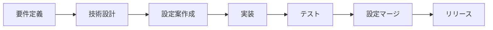

# Feature Development Template

このディレクトリは新機能開発時のテンプレートです。

## 使い方

### 1. 新機能開発開始時
```bash
# テンプレートをコピー
cp -r .shirokuma/development/feature-template .shirokuma/development/feature-[機能名]

# 例：GraphDB機能の開発
cp -r .shirokuma/development/feature-template .shirokuma/development/feature-graphdb
```

### 2. ドキュメント記載
各ファイルを編集して機能の詳細を記載：

- **requirements.md** - ビジネス要件と成功基準を定義
- **specification.md** - 技術的な設計と実装方針を記載
- **configuration.md** - 設定変更やエージェント更新を記載

### 3. 開発中の参照
エージェントから開発中の設定を参照：
```markdown
@.shirokuma/development/feature-graphdb/specification.md
```

### 4. 機能完成時
1. configuration.mdの内容を`.shirokuma/configs/`の適切なファイルにマージ
2. 機能のドキュメントをknowledgeに保存
3. developmentディレクトリから削除（またはarchive/に移動）

## ワークフロー例



## メリット

1. **開発中の設定が本番設定と混在しない**
2. **複数の機能を並行開発できる**
3. **要件から実装まで追跡可能**
4. **レビューが機能単位で可能**

## 注意事項

- 機能名は明確で分かりやすいものにする（例：graphdb, semantic-search, auth-oauth）
- 開発が中止になった場合は、ディレクトリごと削除する
- 長期間更新されない場合は、archiveディレクトリに移動する