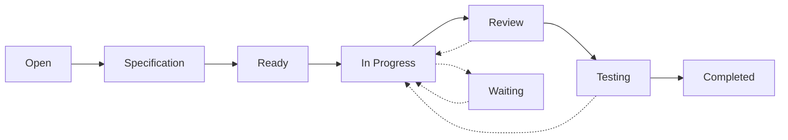
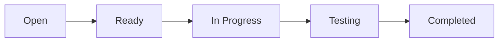
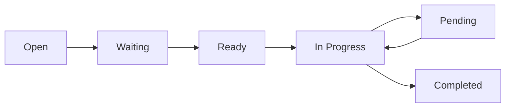
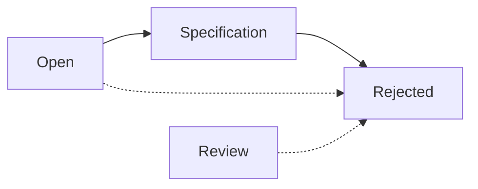

# Status System Guide

## Overview

The status system in shirokuma-knowledge-base provides a standardized workflow for tracking item lifecycle from creation to completion. This guide documents all available statuses, their purposes, transitions, and best practices.

## Status Classification

### Active Statuses (is_closable: false)
These statuses represent ongoing work or states requiring action.

### Terminal Statuses (is_closable: true)
These statuses represent final states where no further action is expected.

## Status Definitions

### 1. Open (Active)
**Purpose**: Initial state for newly created items requiring attention.

**Use Cases**:
- New bug reports
- Feature requests
- Issues awaiting triage
- General items needing review

**Next States**:
- Specification (needs design)
- Ready (can start immediately)
- Waiting (blocked by external factors)
- Rejected (won't fix)

**Example**:
```
Issue: "Application crashes on startup"
Status: Open
Action: Needs investigation and prioritization
```

### 2. Specification (Active)
**Purpose**: Item is being analyzed and specified.

**Use Cases**:
- Requirements gathering
- Design documentation
- Technical specification writing
- Solution architecture planning

**Next States**:
- Ready (specification complete)
- Waiting (needs more information)
- Rejected (not feasible)

**Example**:
```
Feature: "Add OAuth2 authentication"
Status: Specification
Action: Defining security requirements and integration points
```

### 3. Waiting (Active)
**Purpose**: Item is blocked or waiting for external dependencies.

**Use Cases**:
- Waiting for customer feedback
- Blocked by another issue
- Waiting for external API updates
- Pending management decision

**Next States**:
- Ready (unblocked)
- Open (re-evaluation needed)
- Canceled (no longer relevant)

**Example**:
```
Task: "Integrate payment gateway"
Status: Waiting
Reason: Waiting for vendor API credentials
```

### 4. Ready (Active)
**Purpose**: Item is fully specified and ready to be worked on.

**Use Cases**:
- Approved features ready for implementation
- Bugs with clear reproduction steps
- Tasks with all requirements met
- Items in sprint backlog

**Next States**:
- In Progress (work started)
- Waiting (new blocker found)
- Canceled (deprioritized)

**Example**:
```
Bug: "Fix memory leak in data processor"
Status: Ready
Details: Root cause identified, solution approved
```

### 5. In Progress (Active)
**Purpose**: Active development or work is ongoing.

**Use Cases**:
- Code being written
- Documentation being created
- Investigation in progress
- Active debugging

**Next States**:
- Review (work complete, needs review)
- Testing (ready for QA)
- Waiting (blocked during work)
- Pending (paused temporarily)

**Example**:
```
Feature: "User profile management"
Status: In Progress
Current: Implementing backend API endpoints
```

### 6. Review (Active)
**Purpose**: Work is complete and under review.

**Use Cases**:
- Code review
- Documentation review
- Design review
- Security audit

**Next States**:
- Testing (review passed)
- In Progress (changes requested)
- Completed (no testing needed)
- Rejected (review failed)

**Example**:
```
PR: "Add caching layer"
Status: Review
Action: Team reviewing implementation and performance impact
```

### 7. Testing (Active)
**Purpose**: Solution is being tested or validated.

**Use Cases**:
- QA testing
- User acceptance testing
- Performance testing
- Integration testing

**Next States**:
- Completed (all tests passed)
- In Progress (bugs found)
- Review (needs re-review)

**Example**:
```
Feature: "Email notification system"
Status: Testing
Current: Running integration tests with mail server
```

### 8. Pending (Active)
**Purpose**: Work is temporarily paused but will resume.

**Use Cases**:
- Awaiting sprint planning
- Resource temporarily unavailable
- Lower priority, will return to
- Partial completion, paused

**Next States**:
- In Progress (work resumes)
- Ready (reset to backlog)
- Canceled (no longer needed)

**Example**:
```
Task: "Database migration script"
Status: Pending
Reason: Paused for urgent production issue
```

### 9. Completed (Terminal)
**Purpose**: Work is successfully finished and delivered.

**Use Cases**:
- Feature deployed to production
- Bug fix verified and released
- Documentation published
- Task accomplished

**Characteristics**:
- is_closable: true
- Represents successful outcome
- No further action needed
- Can be referenced as done

**Example**:
```
Feature: "Two-factor authentication"
Status: Completed
Result: Deployed to production, 100% test coverage
```

### 10. Closed (Terminal)
**Purpose**: Item is closed without specific resolution.

**Use Cases**:
- Duplicate issues
- No longer relevant
- Superseded by other work
- General closure

**Characteristics**:
- is_closable: true
- Neutral terminal state
- May not represent completion

**Example**:
```
Issue: "Performance degradation"
Status: Closed
Reason: Resolved by infrastructure upgrade
```

### 11. Canceled (Terminal)
**Purpose**: Work was stopped and will not be completed.

**Use Cases**:
- Project canceled
- Feature deprecated before completion
- Requirements changed significantly
- Business priority shifted

**Characteristics**:
- is_closable: true
- Work was started but stopped
- Will not be resumed

**Example**:
```
Feature: "Legacy system integration"
Status: Canceled
Reason: Legacy system being decommissioned
```

### 12. Rejected (Terminal)
**Purpose**: Item was evaluated and declined.

**Use Cases**:
- Won't fix bugs
- Feature requests denied
- Invalid issues
- Out of scope items

**Characteristics**:
- is_closable: true
- Deliberate decision not to proceed
- Usually includes rejection reason

**Example**:
```
Request: "Support Internet Explorer 6"
Status: Rejected
Reason: Below minimum browser requirements
```

## Workflow Diagrams

### Standard Development Flow


### Quick Fix Flow


### Blocked Item Flow


### Rejection Flow


## Status Transition Rules

### Valid Transitions

| From | To | Condition |
|------|-----|-----------|
| Open | Specification | Needs design/analysis |
| Open | Ready | Clear requirements |
| Open | Waiting | Blocked immediately |
| Open | Rejected | Invalid/won't fix |
| Specification | Ready | Specification complete |
| Specification | Waiting | Need more info |
| Specification | Rejected | Not feasible |
| Waiting | Ready | Unblocked |
| Waiting | Open | Needs re-triage |
| Waiting | Canceled | No longer relevant |
| Ready | In Progress | Work begins |
| Ready | Waiting | New blocker |
| Ready | Canceled | Deprioritized |
| In Progress | Review | Work complete |
| In Progress | Testing | Skip review |
| In Progress | Waiting | Blocked |
| In Progress | Pending | Paused |
| Review | Testing | Approved |
| Review | In Progress | Changes needed |
| Review | Completed | No testing needed |
| Review | Rejected | Failed review |
| Testing | Completed | Tests passed |
| Testing | In Progress | Fixes needed |
| Pending | In Progress | Resume work |
| Pending | Ready | Back to backlog |
| Pending | Canceled | Won't resume |

### Invalid Transitions

- Terminal to any status (Completed, Closed, Canceled, Rejected cannot change)
- Skip mandatory review for critical items
- Direct jump from Open to Completed
- Backward flow to Open from later stages (except Waiting)

## Best Practices

### 1. Status Selection Guidelines

**Choose Open when**:
- Creating new items
- Unsure of next steps
- Needs triage or prioritization

**Choose Specification when**:
- Requirements unclear
- Needs technical design
- Requires stakeholder input

**Choose Ready when**:
- All requirements clear
- No blockers exist
- Can start immediately

**Choose In Progress when**:
- Actively working on item
- Making measurable progress
- Have dedicated resources

### 2. Status Update Discipline

- **Update immediately** when state changes
- **Include reasons** for status changes
- **Document blockers** when moving to Waiting
- **Add completion notes** for terminal states

### 3. Terminal Status Selection

```
Completed: Successful delivery of intended outcome
Closed: Generic closure, often for housekeeping
Canceled: Started but stopped, won't continue
Rejected: Evaluated and declined to proceed
```

### 4. Avoiding Status Thrashing

- Don't flip between statuses rapidly
- Ensure transitions are meaningful
- Use Pending for temporary pauses, not Waiting
- Batch related status updates

### 5. Status-Driven Automation

**Automated Actions by Status**:
- **Open**: Send to triage queue
- **Ready**: Add to sprint planning
- **In Progress**: Start time tracking
- **Review**: Notify reviewers
- **Testing**: Trigger test suites
- **Completed**: Update metrics, close related items

## Monitoring and Metrics

### Key Status Metrics

1. **Cycle Time**: Open → Completed duration
2. **Wait Time**: Total time in Waiting status
3. **Review Time**: Time spent in Review status
4. **Test Time**: Duration in Testing status
5. **Completion Rate**: Completed vs Canceled/Rejected

### Status Distribution Targets

```
Healthy Distribution:
- Open: < 20% (good triage)
- Specification: < 10% (clear requirements)
- Waiting: < 15% (few blockers)
- Ready: 20-30% (healthy backlog)
- In Progress: 15-25% (active work)
- Review: < 10% (quick reviews)
- Testing: < 10% (efficient QA)
- Pending: < 5% (minimal pauses)
- Terminal: 20-30% (good completion)
```

### Warning Signs

- High Waiting percentage: Process bottlenecks
- High Pending percentage: Resource issues
- Low Completed percentage: Delivery problems
- High Rejected percentage: Poor requirement quality

## Integration with Item Types

### Issue Type
- Typically starts at **Open**
- Quick fixes may jump to **Ready**
- Bugs often need **Testing**

### Knowledge Type
- May start at **Specification** for planning
- Often skips **Testing**
- Review important for accuracy

### Decision Type
- Heavy **Specification** phase
- May skip **Testing**
- **Review** critical for stakeholder buy-in

### Task Type
- Often starts at **Ready**
- Standard development flow
- Clear **Completed** criteria

## Status API Usage

### Filtering by Status
```typescript
list_items({
  filters: {
    status: "Open"
  }
})
```

### Status Transitions
```typescript
update_item({
  id: 123,
  status: "In Progress"
})
```

### Closable Status Check
```typescript
// Check if status allows closure
const item = await get_item(123);
const status = await get_status(item.statusId);
if (status.is_closable) {
  // Can be archived or deleted
}
```

## Troubleshooting

### Common Issues

**Problem**: Items stuck in Waiting
**Solution**: Regular review of blocked items, escalation process

**Problem**: Skipping Review status
**Solution**: Enforce review requirements for critical types

**Problem**: Direct to Completed without Testing
**Solution**: Add validation rules for test-required items

**Problem**: Unclear when to use Closed vs Canceled
**Solution**: Closed for external resolution, Canceled for internal decision

## Summary

The status system provides a flexible yet structured approach to managing item lifecycle. By understanding each status's purpose and following transition best practices, teams can maintain clear visibility into work progress and make data-driven decisions about resource allocation and process improvement.

Key takeaways:
1. Use statuses consistently across all item types
2. Document status change reasons
3. Monitor status metrics for process health
4. Automate workflows based on status transitions
5. Regular review of items in blocking statuses